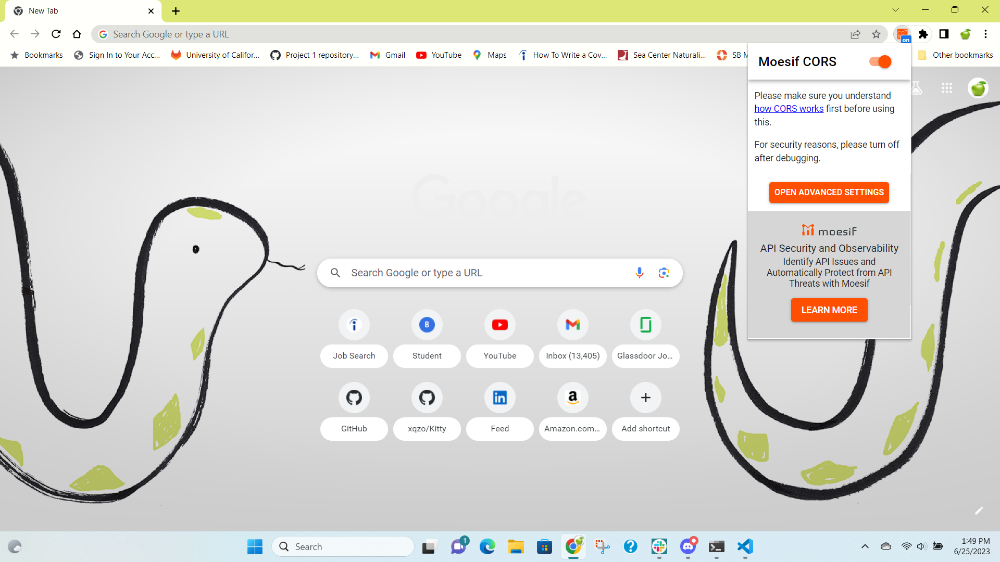

# Kitty Quest

## Description

Kitty Quest is an interactive webpage that generates fun and cute photos of cats with an interesting cat-related fact to complement! Our motivation to build this project is both to bring joy to our users in the form of cute kittens, and educate them on a topic they may be curious about...

No longer will people have to struggle by searching for their own cute kitten photos, as Kitty Quest provides a quality database of only the best media friendly for all kitten lovers out there.

As developers of a technological marvel, it’s only natural for there to be some bumps in the road... We encountered issues with communication and incorporating localStorage. In the future, we do hope to implement a more engaging interface, along with possible branches into other facets of the animal kingdom. Imagine an innovated “Kitty Quest” that includes a plethora of adorable fauna to learn about!

Here is a [presentation](https://docs.google.com/presentation/d/1fS1XWilwuy1sI-x_VTZxI5Nk_DCCVPqKJ6pESrF8rbw/edit?usp=sharing) that explains our project in more detail.

## Installation
Using this project requires a Google Chrome extension called [Moesif Origin & CORS Changer](https://chrome.google.com/webstore/detail/moesif-origin-cors-change/digfbfaphojjndkpccljibejjbppifbc). Without this extension installed, the attempt by the save button to download the image will be blocked by [CORS (Cross-Origin Resource Sharing) policy](https://www.moesif.com/blog/technical/cors/Authoritative-Guide-to-CORS-Cross-Origin-Resource-Sharing-for-REST-APIs/). Make sure that the extension is installed and turned on:

## Usage
Kitty Quest is straightforward enough for anyone to get the hang of! With our simple UI, users are able to generate their kitten fact and photo with the touch of a button. In case the user finds one such picture to be special, they’re also able to save them using our save button.

The following images demonstrate the website's appearance:

The link to the deployed website can be found [here](https://xqzo.github.io/Kitty-Quiz/).

## Credits
#### Creators
The wonderful team members behind Kitty Quest were...\
[Eric Wang](https://github.com/GimmeKitties711) and [Antonio Morales](https://github.com/xqzo)

#### Collaboration
Received help throughout the project from TA's Elena Rogers and Michael Seaman.\
Cat Facts API key created by Michael Seaman.

#### Web Resources
The following web resources helped us write the code for this project:

1. [Bulma: changing text and background colors](https://bulma.io/documentation/helpers/color-helpers/)
2. [Bulma: responsive column layouts](https://bulma.io/documentation/columns/responsiveness/)
3. [Bulma: styling buttons](https://bulma.io/documentation/elements/button/)
4. [axios JavaScript library](https://cdnjs.com/libraries/axios)
5. [Random hex code generator](https://www.random.org/colors/hex)
6. [The Cat API documentation](https://developers.thecatapi.com/view-account/ylX4blBYT9FaoVd6OhvR?report=bOoHBz-8t)
7. [Meaning of blob](https://www.cloudflare.com/learning/cloud/what-is-blob-storage/)
8. [Stack Overflow: how to download files using axios](https://stackoverflow.com/questions/41938718/how-to-download-files-using-axios)
9. [YouTube: How to Save Images to Local/Session Storage - JavaScript Tutorial](https://www.youtube.com/watch?v=8K2ihr3NC40)
10. [Meaning of DOMContentLoaded](https://developer.mozilla.org/en-US/docs/Web/API/Document/DOMContentLoaded_event)

## License
No license is attached to this repository.
